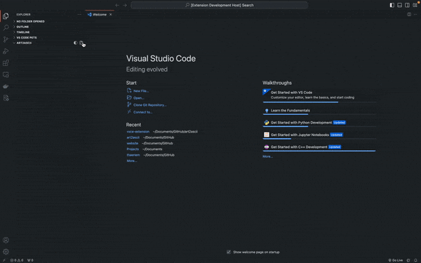
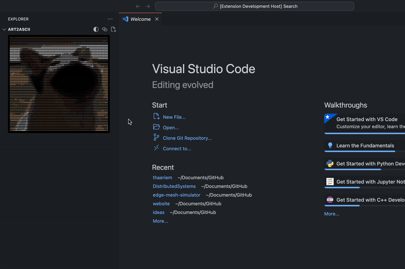
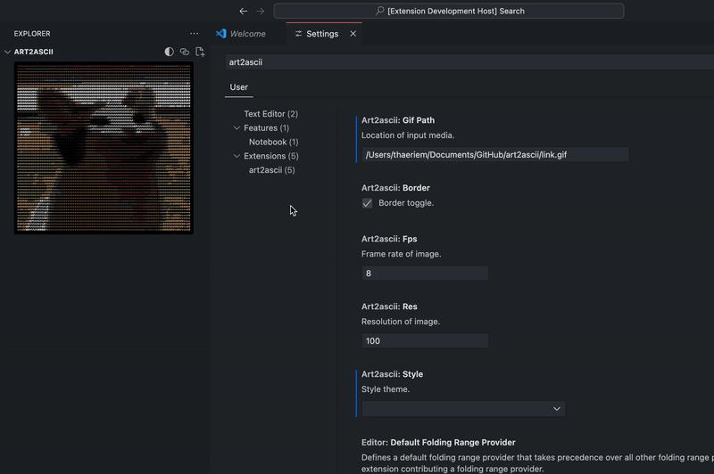

# art2ascii

art2ascii is a VS Code extension that allows users to select GIF's and play them in ASCII form directly within the Tree View tab of the workspace. 

## Features

- Converts selected GIF files into ASCII art and plays in Explorer tab of workspace.
- Upload GIF's or paste links to import and play them.
- Add style palettes to image.
- Lightweight and easy to use.

## Usage

### Installation / Upload Media
1. Install the art2ascii extension from the Visual Studio Code Marketplace or through the extensions page on VSCode.
2. Open a workspace or create a new one.
3. In the Explorer view, press the Upload Image/Gif button or `art2ascii.upload-art` in Command Palette.
4. Your ASCII GIF will be compiling in the background and when completed it will reload the extension view.

### Paste Links (GIPHY, Tenor, Imgur, etc.)
1. Press the link button or `art2ascii.paste-link` in Command Palette.
2. Paste link and press enter.

### Adding Styles
1. Press the style button or `art2ascii.style` in Command Palette.
2. Choose style from menu.

### Additional Settings (resolution, border, fps)
1. Open VSCode Settings (UI or Json).
2. Set desired resolution (10 to 100), fps (1 to 12), border (true or false).
3. Reload the window.

## Requirements

- Visual Studio Code version 1.74.0 or higher.

## Known Issues and Future Updates

- Some GIF files may be too big to render properly (usually anything under 10MB should be fine)
- Working towards allowing users to add and manage their own styles by importing palettes

## Release Notes

### Version 1.3.0
- Replaced tint/gradient system for styles
- Added 10 default styles
- Refactor for fps, resolution, and border fields
- Added border for light mode accessibility 
- Added ability to paste links from GIPHY, Tenor, Imgur, etc. to import locally

### Version 1.2.1
- Fixed bundling issue with sharp but had to downgrade from 0.33.4 -> 0.32.6, roughly 200 file load improvement
- Updated demo + icon on VS Marketplace

### Version 1.2.0
- Added color menu with tint and gradient options.
- Added opacity option for tints and gradients.
- Refactored how configs are loaded for better performance.
- Fixed bug when closing extension webviewView.

### Version 1.1.1
- Completely rewrote renderer in TypeScript, removing Python dependency and moving rendering from terminal to client-side.
- Improved efficiency by cutting out file read / writes entirely and only storing gifUri's and loading when neccesary.
- Implemented auto-reload feature rather than having to reload entire workspace view.

### Version 1.0.3
- GIF to ASCII conversion.
- Display ASCII animation in the Tree View tab.

## Feedback and Contributions

Feel free to leave feedback! If you encounter any issues or have suggestions for improvement, please [submit an issue](https://github.com/Thaeriem/art2ascii/issues) on GitHub.

## License

This extension is licensed under the [MIT License](https://github.com/Thaeriem/art2ascii/blob/main/LICENSE).
