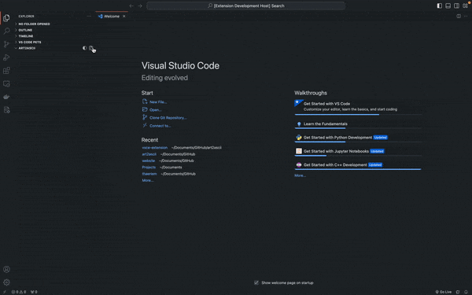
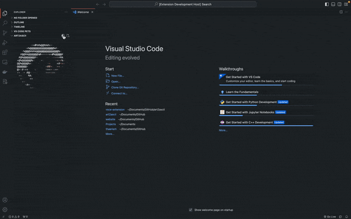
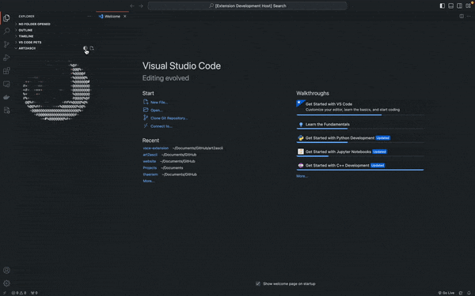

# art2ascii

art2ascii is a Visual Studio Code extension that allows users to select a GIF and play it in ASCII form directly within the Tree View tab of the workspace. 

There is also a seperate Python CLI for rendering, playing, and saving your images and GIFs in terminal [here](https://github.com/Thaeriem/art2ascii/tree/1.0.3)!

## Features

- Converts selected GIF files into ASCII art and plays in Explorer tab of workspace.
- Supports basic GIF animations.
- Apply tint or gradient to image to customize how GIF is rendered.
- Lightweight and easy to use.

## Usage

### Installation / Upload Media
1. Install the art2ascii extension from the Visual Studio Code Marketplace or through the extensions page on VSCode.
2. Open a workspace or create a new one.
3. In the Explorer view, press the Upload Image/Gif button or `art2ascii.upload-art` in Command Palette.
4. Your ASCII GIF will be compiling in the background and when completed it will reload the extension view.

### Adding Tint / Gradient
1. Press the Color Menu button or `art2ascii.color-menu` in Command Palette.
2. Select Tint or Gradient respectively (you can also skip this step by running either `art2ascii.update-tint` or `art2ascii.update-gradient`).
3. Input selected hexadecimal color in the form `#000000` or `000000`, two colors need to be selected for gradient.

## Requirements

- Visual Studio Code version 1.74.0 or higher.

## Known Issues

- Some GIF files may be too big to render properly (usually anything under 10MB should be fine)
- Extension cannot currently be bundled properly due to a dependency issue with sharp compiling on cross-platform builds (planning to continue working on this but will be a small performance hit for now...)
- Working on a better way to interface with webviewView to improve performance

## Release Notes

### Version 1.2.0
- Added color menu with tint and gradient options.
- Added opacity option for tints and gradients.
- Refactored how configs are loaded for better performance.
- Fixed bug when closing extension webviewView.

### Version 1.1.1
- Completely rewrote renderer in TypeScript, removing Python dependency and moving rendering from terminal to client-side.
- Improved efficiency by cutting out file read / writes entirely and only storing gifUri's and loading when neccesary.
- Implemented auto-reload feature rather than having to reload entire workspace view.

### Version 1.0.3
- GIF to ASCII conversion.
- Display ASCII animation in the Tree View tab.

## Feedback and Contributions

We welcome feedback and contributions from the community. If you encounter any issues or have suggestions for improvement, please [submit an issue](https://github.com/Thaeriem/art2ascii/issues) on GitHub.

## License

This extension is licensed under the [MIT License](https://github.com/Thaeriem/art2ascii/blob/main/LICENSE).