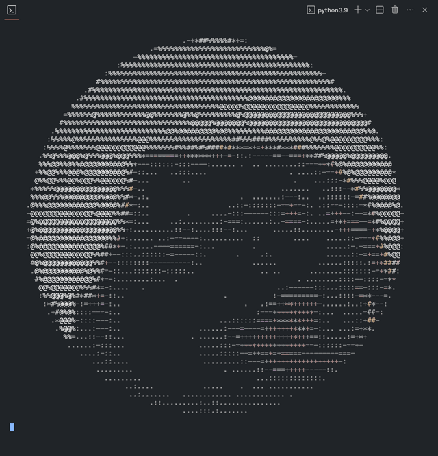

# art2ascii

A command-line tool to convert images and GIFs into ASCII art.
- Displays in terminal with 256 colors 
- Optimized nearest color algortihm with [k-d trees][1]
- Can be downloaded as image (support for GIFs is currently macOS only)[^1]

<p align="center">

</p>

## Getting Started

This is an example of how you may give instructions on setting up your project locally.
To get a local copy up and running follow these simple example steps.

### Prerequisites

This is an example of how to list things you need to use the software and how to install them.
* npm
  ```sh
  npm install npm@latest -g
  ```

### Installation

_Below is an example of how you can instruct your audience on installing and setting up your app. This template doesn't rely on any external dependencies or services._

1. Get a free API Key at [https://example.com](https://example.com)
2. Clone the repo
   ```sh
   git clone https://github.com/your_username_/Project-Name.git
   ```
3. Install NPM packages
   ```sh
   npm install
   ```
4. Enter your API in `config.js`
   ```js
   const API_KEY = 'ENTER YOUR API';
   ```


<!-- USAGE EXAMPLES -->
## Usage
```sh
art2ascii ver: 1.0.0
~ GitHub: https://github.com/Thaeriem/art2ascii
~ Issues: https://github.com/Thaeriem/art2ascii/issues
~ Author: Thaeriem

Usage: art2ascii -f <file> -s

Options:
  -f    Image/Gif filename [string]
  -g    Greyscale (default false)
  -r    Resize [float] (default 1.0)
  -w    Width [int] (default 100)
  -s    Save File (default false)
```


## Built With

* [Pillow](https://pillow.readthedocs.io/en/stable/) - Python Imaging Library
* [imageio](https://imageio.readthedocs.io/en/stable/) - For Creating GIFs
* [pyautogui](https://pyautogui.readthedocs.io/en/latest/) - For taking screenshots of terminal

[^1]: Support

[1]: https://en.wikipedia.org/wiki/K-d_tree "Wikipedia: K-d trees"