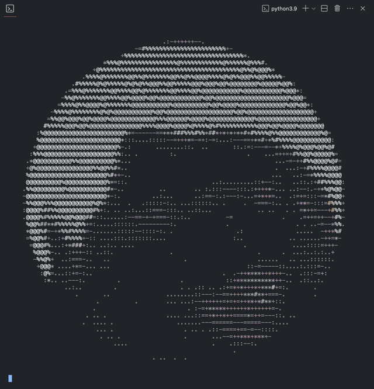

# art2ascii

A command-line tool to convert images and GIFs into ASCII art.
- Displays in terminal with 256 colors 
- Optimized nearest color algortihm with [k-d trees][1]
- Can be downloaded as image (support for GIFs is currently macOS only)[^1]

<p align="center">

</p>

## Getting Started


### Prerequisites


* [python][2]
* [pip][3]
  ```sh
  python3 -m ensurepip
  # or
  brew install pip
  ```

### Installation

Run the following command:
```sh
pip install git+https://github.com/Thaeriem/art2ascii.git@1.0.1
```


<!-- USAGE EXAMPLES -->
## Usage
```sh
art2ascii ver: 1.0.1
~ GitHub: https://github.com/Thaeriem/art2ascii
~ Issues: https://github.com/Thaeriem/art2ascii/issues
~ Author: Thaeriem

usage: art2ascii [-h] [-f FILENAME] [-g] [-r RESIZE] [-w WIDTH] [-s] [-l LOOPS] [-b BORDER]

Command line options for converting images/GIFs into ASCII art.

optional arguments:
  -h, --help            show this help message and exit
  -f FILENAME, --filename FILENAME
                        Image/GIF filename
  -g, --greyscale       Enable greyscale (default: false)
  -r RESIZE, --resize RESIZE
                        Resize factor (default: 1.0)
  -w WIDTH, --width WIDTH
                        Width (default: 100)
  -s, --save            Save file (default: false)
  -l LOOPS, --loops LOOPS
                        Number of times to loop (default: 10)
  -b BORDER, --border BORDER
                        Border input (format: "left,top,right,bottom")
```
```sh

```


## Built With

* [Pillow](https://pillow.readthedocs.io/en/stable/) - Python Imaging Library
* [imageio](https://imageio.readthedocs.io/en/stable/) - For Creating GIFs
* [pyautogui](https://pyautogui.readthedocs.io/en/latest/) - For taking screenshots of terminal

[^1]: Support

[1]: https://en.wikipedia.org/wiki/K-d_tree "Wikipedia: K-d trees"
[2]: https://www.python.org/downloads/ "Python download"
[3]: https://pip.pypa.io/en/stable/installation/ "Pip install"